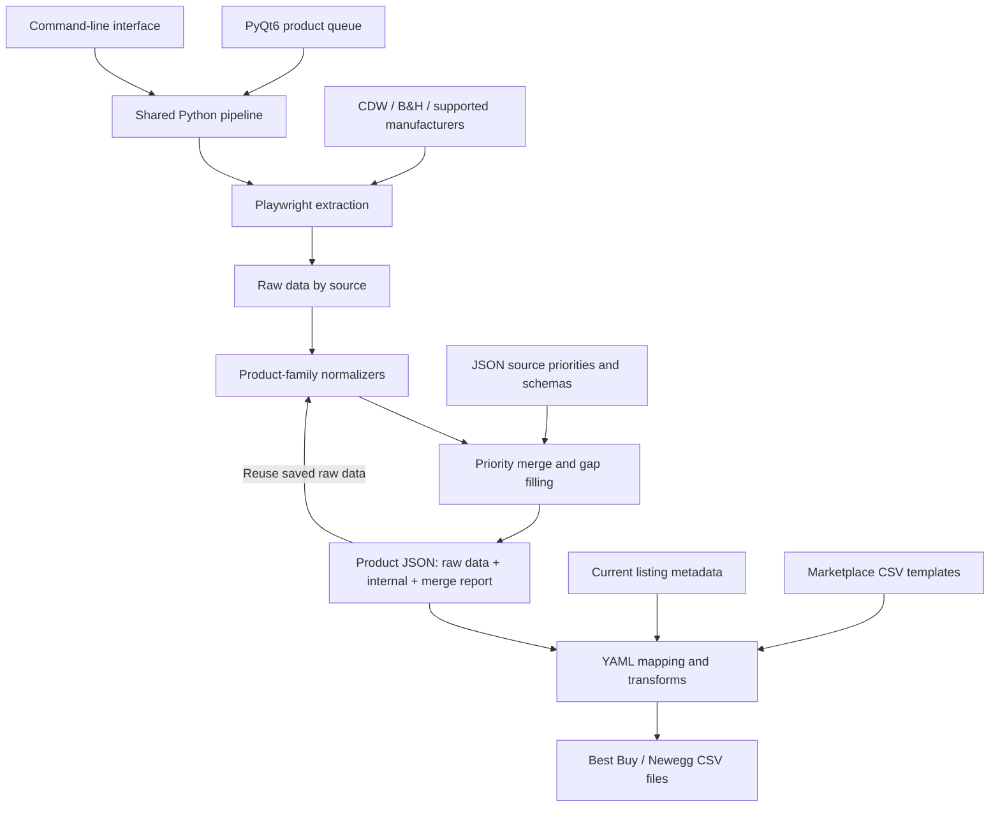

# ETL Scraper

**A Python desktop application that turns product data from multiple websites into structured marketplace listings.**

ETL Scraper addresses a practical catalog-management problem: the same product can have different specification labels, units, descriptions, and packaging details across retailer websites. Preparing a listing for another marketplace means reconciling those sources and adapting the result to a different CSV format.

This project implements that workflow from extraction to export. Users queue products by manufacturer part number (MPN), collect data through browser automation, merge it into a shared schema, and generate Best Buy or Newegg listing files through configurable YAML mappings.

**Stack:** Python · PyQt6 · Playwright / Chromium · JSON schemas · YAML mappings · CSV export

## Key capabilities

- **Multiple data sources:** CDW and B&H scraping, with manufacturer fallback where an adapter is implemented and enabled.
- **Product-family normalization:** schemas and normalizers for laptops, monitors, systems, and cooling accessories.
- **Configurable source selection:** separate priorities for specifications, packaging, photos, feature bullets, and long descriptions.
- **Reusable scrape data:** preserve raw source data so normalized products can be rebuilt without another browser session.
- **Batch queue:** scrape each unique MPN once, then apply listing settings separately to each queue row.
- **Marketplace-specific output:** YAML rules map normalized fields, raw specifications, and listing metadata to CSV columns.
- **Operator controls:** editable listing fields, optional photo downloads, progress logs, and a manual continuation prompt when Google presents a CAPTCHA.

## Desktop UI

The PyQt6 window is organized around a scrollable queue of collapsible product cards. A toolbar opens settings and the YAML generator; the bottom action bar runs the queue or exports listings. A resizable log panel shows source selection, progress, output paths, and warnings.

| UI area | What the user can do |
| --- | --- |
| Product cards | Add or remove items; select category, manufacturer, and condition; enter MPN, SKU, UPC, and price. MPNs are uppercased, and a SKU is generated from category, MPN, and condition. |
| Newegg panel | Enable or disable export, choose shipping, and override the shared UPC. |
| Best Buy panel | Enable or disable export, select package size and an environmental handling fee (EHF) profile, and set a marketplace UPC. Shared price updates the discount and suggested list price. |
| Settings | Drag source cards to change priorities for five data groups; toggle photo downloads; configure Best Buy discount dates. |
| YAML generator | Create mapping scaffolds from template CSV headers for one category or all missing mappings. Replacing an existing mapping requires confirmation. |
| Run scrape | Validate the queue and start browser extraction. When saved product data exists, choose **Use existing JSON** or **Scrape again**. |
| Export all | Apply each card's current listing metadata to saved product data and write files for its enabled marketplaces. |
| Show log | Inspect progress, merge decisions, export warnings, and errors. |

Live scraping runs in a `QThread`, with Qt signals delivering log messages and completion events to the UI. Run and export controls are disabled while the scrape worker is active.

## User workflow

1. **Add products.** Click **+ Add item**, select the product category, manufacturer, and condition, then enter an MPN. Add more cards for a batch or for different listing conditions of the same product.
2. **Choose listing settings.** Enter SKU, UPC, and price; enable the required marketplaces. For Best Buy export, select package size and an EHF profile.
3. **Set source priorities.** Open **Settings** to choose which sources should supply each data group. For example, packaging can prefer B&H while specifications prefer CDW.
4. **Collect or reuse data.** Click **Run scrape**. A visible Chromium window opens when extraction is needed. **Use existing JSON** rebuilds the normalized product from saved raw data; **Scrape again** requests a refresh.
5. **Inspect the result.** Review the log and the saved `products/{MPN}.json`. The file keeps source data, normalized fields, and a merge report.
6. **Export listings.** Click **Export all** to combine saved product data with each card's listing settings and write marketplace CSV files under `output/exports/`.

For example, two cards with the same MPN can represent a brand-new listing and an open-box listing. They share one scrape job while retaining separate submission settings. Changing price or condition does not require scraping the product again.

## Data flow and architecture



The persisted product document separates three concerns:

| Layer | Purpose |
| --- | --- |
| `scraped_data` | Raw data keyed by source. Retains the evidence needed to debug or re-run normalization. |
| `internal` | Shared product representation derived from source data and the selected product-family schema. |
| `merge_report` | Records source winners and gap-fill decisions for inspection. |

`submission` holds listing-specific fields such as condition, SKU, price, and marketplace options. It is attached at export time and excluded from persisted product JSON.

### Engineering decisions

- **Separate extraction from normalization.** Site adapters capture source data; normalizers translate it into a shared structure. A normalization fix can be applied to saved data without contacting the site again.
- **Make source precedence explicit.** Different sources can win different data groups. The merge layer fills eligible missing specification fields from lower-priority sources and records those decisions.
- **Keep marketplace rules in configuration.** YAML mappings support field paths, source fallbacks, transforms, formatting, and allowed-value warnings. Changing a CSV mapping does not require editing the browser scraper.
- **Separate product identity from listing identity.** Deduplicating by MPN avoids repeated extraction while allowing different conditions and marketplace settings for the same product.
- **Share the pipeline between GUI and CLI.** The interfaces call the same core extraction, normalization, and export modules.

These choices demonstrate browser automation, data modeling, ETL orchestration, configuration-driven transformation, and desktop application development within one workflow.

## Repository guide

```text
main.py                    GUI and CLI entry point
core/
  pipeline.py              Scrape orchestration, reuse, and batch deduplication
  normalizer.py            Source normalization and product document assembly
  merge/field_merge.py     Priority-based merging and missing-field fallback
  schema/                  Schema loading and internal product helpers
  mapping/                 YAML rule resolution and field mapping
  transforms.py            Marketplace formatting and conversion functions
  exporter.py              Template-aware CSV output
sites/                     Retailer and manufacturer adapters / normalizers
gui/                       Product cards, settings, dialogs, and worker thread
configs/                   Schemas, categories, mappings, and source policies
scripts/                   Command-line YAML generation tools
tests/                     Focused regression checks
docs/                      Product flow, mapping guide, and review notes
```

## Getting started

Use **Python 3.12 or later**. A **64-bit Python installation** is recommended for the GUI and browser dependencies.

### Windows / PowerShell

```powershell
# Select an installed 64-bit Python version; this example uses 3.13.
py -3.13 -m venv .venv
.\.venv\Scripts\python -m pip install -r requirements.txt
.\.venv\Scripts\python -m playwright install chromium
.\.venv\Scripts\python main.py
```

### macOS / Linux

```bash
python3 -m venv .venv
.venv/bin/python -m pip install -r requirements.txt
.venv/bin/python -m playwright install chromium
.venv/bin/python main.py
```

Launch commands are provided for both environments; GUI and live-scrape compatibility still depend on local dependencies and the target websites.

### Marketplace templates

Scraping and normalization can be explored without marketplace CSV templates. Export requires locally supplied template files, which are not included in this repository.

| Marketplace | Template location |
| --- | --- |
| Best Buy | `templates/bestbuy/csv/{category_id}.csv` |
| Newegg | `templates/newegg/csv/{marketplace_code}.csv` |

Template IDs and marketplace codes are defined in [categories.json](configs/categories/categories.json). For example, the laptop category uses `CAT_1002` for Best Buy and `Notebooks` for Newegg. Header offsets are configured in [marketplace_templates.json](configs/marketplace_templates.json): Best Buy defaults to zero preamble rows and Newegg to one.

Use the **YAML** toolbar button to generate mapping scaffolds from the templates, then review and customize the field rules before exporting.

## Command-line usage

The following examples use the Windows virtual environment. On macOS/Linux, substitute `.venv/bin/python`.

```powershell
# Extract and normalize a product.
.\.venv\Scripts\python main.py --cli --mpn DYFPN --manufacturer Dell --category notebook

# Export an existing product JSON; requires a local Best Buy template.
.\.venv\Scripts\python main.py --export-bestbuy --mpn DYFPN --category notebook --condition new --price 799 --ehf-profile NB

# List available options.
.\.venv\Scripts\python main.py --help
```

Source availability is controlled by `configs/scrapers/` and `configs/manufacturers.json`; visit order and merge priorities are configured in `configs/merge_sources.json`. A configured manufacturer does not necessarily have a complete scraper implementation.

## Outputs and checks

| Output | Location |
| --- | --- |
| Raw and normalized product data | `products/{MPN}.json` |
| Marketplace listing files | `output/exports/` |
| Optional product photos | `output/images/{MPN}/` |

The focused regression suite uses the Python standard library:

```powershell
py -m unittest discover -s tests -v
```

It covers filename/path safety, settings fallback and preservation, and browser startup resource handling with a mocked Playwright runtime. It does not establish live website compatibility or validate complete marketplace submissions.

## Scope and current limitations

This is a local catalog-preparation tool. It generates CSV files for review and upload; it does not publish listings through marketplace APIs. Coverage varies by source and product family, and website layout changes can require adapter updates. Google CAPTCHA handling relies on manual completion in the browser.

New generated products, exports, templates, credentials, and browser session files are ignored by Git. A small number of product JSON files are already tracked; ignore rules do not remove existing tracked files. Keep private inventory data and credentials out of public commits.

Further details:

- [Product flow and schema design](docs/PRODUCT_FLOW.md)
- [YAML configuration guide](docs/YAML_CONFIG.MD)
- [Repository review and remaining improvements](docs/REPOSITORY_REVIEW.md)

## License

[MIT](LICENSE)
